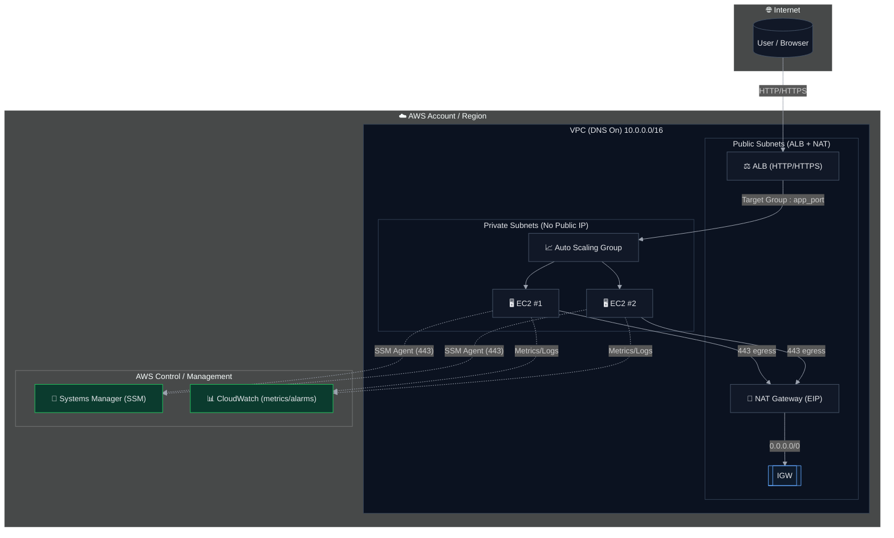

## 🚀 AWS Auto Scaling Infrastructure with Private Subnets, NAT Gateway, and SSM Access

### 📘 Overview

This project provisions a highly available and secure AWS infrastructure using Terraform.
It demonstrates how to deploy a scalable web application in private subnets with auto scaling, load balancing, and secure access via AWS Systems Manager (SSM) — without exposing instances to the public Internet.

### 🧩 Architecture




### ⚙️ Key Components

| Component                           | Description                                               |
| ----------------------------------- | --------------------------------------------------------- |
| **VPC**                             | Custom VPC with DNS support enabled                       |
| **Public Subnets**                  | Contain the ALB and NAT Gateway                           |
| **Private Subnets**                 | Host EC2 instances managed by Auto Scaling                |
| **NAT Gateway**                     | Allows private instances to access the Internet securely  |
| **Auto Scaling Group (ASG)**        | Scales EC2 instances based on load                        |
| **Application Load Balancer (ALB)** | Distributes incoming traffic across EC2 instances         |
| **Security Groups**                 | Restrict inbound and outbound access per layer            |
| **IAM Roles**                       | Grant SSM and EC2 permissions securely                    |
| **SSM Agent Access**                | Enables shell access via AWS Console (no SSH keys needed) |


### 🧱 Terraform Structure

```bash

├── envs
│   └── dev
│       ├── backend.tf
│       ├── dev.tfvars
│       ├── main.tf
│       ├── outputs.tf
│       ├── providers.tf
│       ├── terraform.tfstate
│       ├── terraform.tfstate.backup
│       └── variables.tf
└── modules
    ├── alb
    │   ├── main.tf
    │   ├── outputs.tf
    │   └── variables.tf
    ├── asg
    │   ├── main.tf
    │   ├── outputs.tf
    │   └── variables.tf
    ├── ec2
    │   ├── datasource.tf
    │   ├── main.tf
    │   ├── outputs.tf
    │   ├── user-data.sh
    │   └── variables.tf
    ├── monitoring
    │   ├── main.tf
    │   ├── outputs.tf
    │   └── variables.tf
    ├── security_groups
    │   ├── main.tf
    │   ├── outputs.tf
    │   └── variables.tf
    └── vpc
        ├── datasource.tf
        ├── main.tf
        ├── outputs.tf
        └── variables.tf

```

### 🔐 Security Highlights

* **No public IP** on EC2 instances

* **SSM Session Manager** used for private access (no SSH)

* **Least privilege IAM roles** for EC2 and Terraform

* **Outbound-only Internet access** via NAT Gateway
  
* **Granular Security Groups** between ALB and EC2 tiers

### 🧰 Prerequisites

* Terraform ≥ 1.5
* AWS CLI configured (aws configure)
* An AWS IAM user or role with sufficient privileges to create VPC, EC2, IAM, and ALB resources
* A default region set in your AWS CLI config (e.g., us-east-1)

### 🚀 Deployment

``` bash
terraform init
terraform plan -var-file="dev.tfvars"
terraform apply -var-file="dev.tfvars"
```

### 🔍 Testing

After deployment:

**✅ Check SSM connectivity**

Go to AWS Console → Systems Manager → Fleet Manager → Managed Instances
Your EC2 instances should show "Online".

**✅ Test load balancing**
``` bash
curl http://<alb_dns_name>
```
**✅ Auto Scaling test**
``` bash
sudo yum install stress -y
stress --cpu 4 --timeout 300
```

